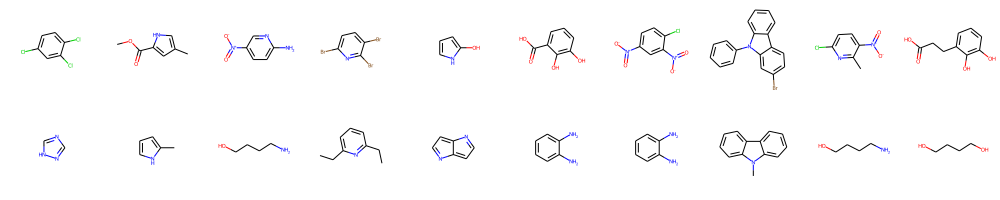
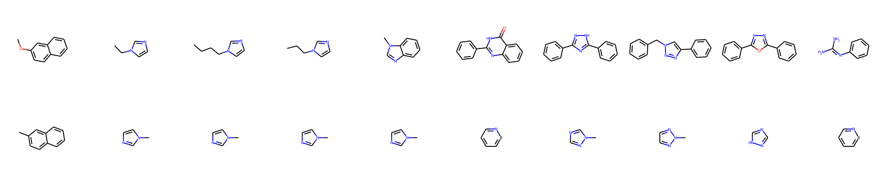

# Molecule-Discovery-by-Context
Repo for "Molecule-Discovery-by-Context" project in the LLM for Materials Hackathon

See more details in the paper: [14 Examples of How LLMs Can Transform Materials Science and Chemistry: A Reflection on a Large Language Model Hackathon](https://arxiv.org/abs/2306.06283)

The escalating climate crisis necessitates the deployment of clean, sustainable fuels to reduce carbon emissions. Hydrogen, with its potential to prevent approximately 60 gigatons of CO2 emissions by 2050 according to the World Economic Forum, stands as a promising solution. However, its storage and shipping remain formidable challenges due to the necessity for high-pressure tanks. To address this, we sought new molecules to which hydrogen could be conveniently added for storage. Traditional screening methods, like brainstorming, are insufficient due to their limited throughput. This research proposes a novel method of leveraging ScholarBERT, a pre-trained science-focused LLM, to screen potential hydrogen carrier molecules efficiently. This approach utilizes ScholarBERT's ability to understand and relate the context of scientific literature. The data used for this study consisted of three datasets. The "Known" dataset comprised 78 known hydrogen carrier molecules. The "Relevant" dataset included 577 molecules, all of which are structurally similar to the Known molecules. The "Random" dataset contained 111 randomly selected molecules from the PubChem database.
The first step involved searching for contexts for molecules in the Public Resource Dataset (PRD), which includes 75M English language research articles. These contexts were then fed into ScholarBERT. For each context, three calculations were made: (a) the average of the last four encoder layers in ScholarBERT, (b) the average embedding of all tokens constituting the molecule name as one contextualized embedding for this molecule, and (c) the average of all contextualized embeddings for a molecule as ScholarBERT's representation of this molecule.
In the second step, we calculated the similarity between the Known molecules and the candidate molecules. The definition of "similarity" used in this study was the cosine similarity between the ScholarBERT representations of two molecules. We then sorted the candidates based on the similarity score in descending order, with a higher score indicating greater potential as a hydrogen carrier.



Fig. 1: Each column shows a Known molecule on the bottom and its top candidate molecule from the Random set on the top



Fig. 2: Each column shows a Known molecule on the bottom and its top candidate molecule from the Relevant set on the top

Fig 1 and 2 show the candidate molecules with the highest similarity to the known molecules. We can see that ScholarBERT does a passable job finding similar molecules from the random set. We do see that it favors finding molecules with 5- and 6-member rings, though with features we didn't expect like halogens. On the other hand, ScholarBERT does a much better job when we reduce the search space to those with structural similarity. We see that molecules with 5-member rings, for instance, are found to be similar structurally and in how they are described in the literature via ScholarBERT.


**Bibliography:**
```
@misc{jablonka202314,
      title={14 Examples of How LLMs Can Transform Materials Science and Chemistry: A Reflection on a Large Language Model Hackathon}, 
      author={Kevin Maik Jablonka and Qianxiang Ai and Alexander Al-Feghali and Shruti Badhwar and Joshua D. Bocarsly Andres M Bran and Stefan Bringuier and L. Catherine Brinson and Kamal Choudhary and Defne Circi and Sam Cox and Wibe A. de Jong and Matthew L. Evans and Nicolas Gastellu and Jerome Genzling and María Victoria Gil and Ankur K. Gupta and Zhi Hong and Alishba Imran and Sabine Kruschwitz and Anne Labarre and Jakub Lála and Tao Liu and Steven Ma and Sauradeep Majumdar and Garrett W. Merz and Nicolas Moitessier and Elias Moubarak and Beatriz Mouriño and Brenden Pelkie and Michael Pieler and Mayk Caldas Ramos and Bojana Ranković and Samuel G. Rodriques and Jacob N. Sanders and Philippe Schwaller and Marcus Schwarting and Jiale Shi and Berend Smit and Ben E. Smith and Joren Van Heck and Christoph Völker and Logan Ward and Sean Warren and Benjamin Weiser and Sylvester Zhang and Xiaoqi Zhang and Ghezal Ahmad Zia and Aristana Scourtas and KJ Schmidt and Ian Foster and Andrew D. White and Ben Blaiszik},
      year={2023},
      eprint={2306.06283},
      archivePrefix={arXiv},
      primaryClass={cond-mat.mtrl-sci}
}
```
